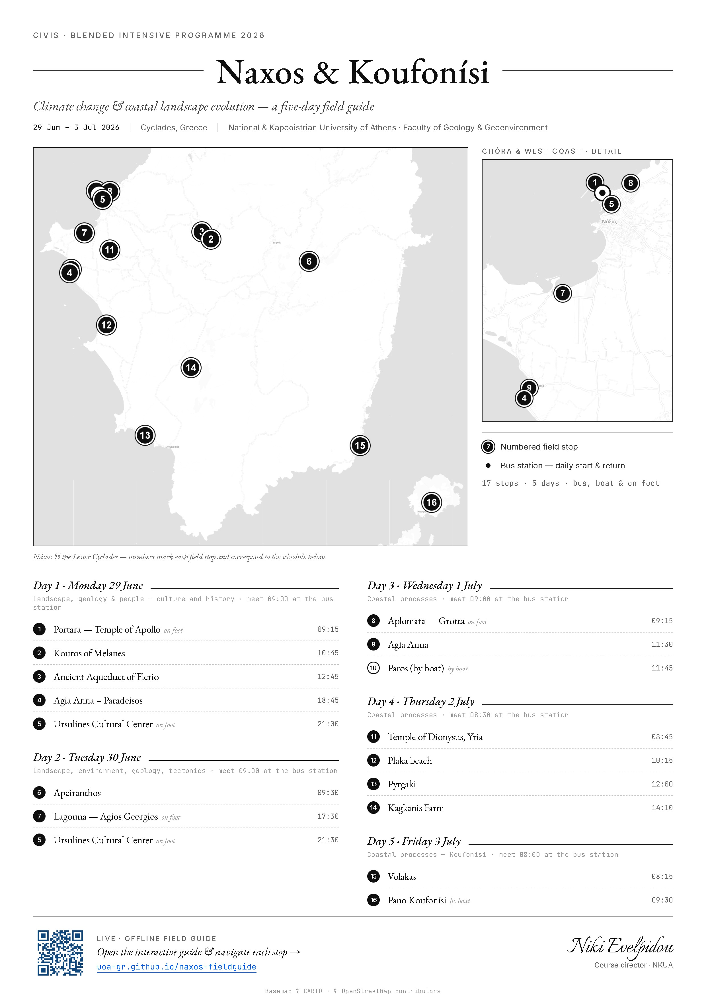

# Naxos & Koufonísi — CIVIS BIP 2026 field guide

A self-guided, installable web app (PWA) for the CIVIS Blended Intensive Programme 2026
**“Climate change and coastal landscape evolution in the Mediterranean context”**
(physical part, Naxos & Koufonísi, 29 June – 3 July 2026).

It replaces the old opaque Google Maps links with **one link / one QR code**. Each stop shows its
time, transport mode, title, photo and a short description, plus a single **“Open in your map app”**
button that opens that exact spot in the attendee’s own app — Apple Maps on iPhone, Google Maps
everywhere, Organic Maps / OsmAnd on Android — and a copy-coordinates fallback. It works **offline**
once opened, which matters on the islands where signal is patchy.

Prepared for **Prof. Niki Evelpidou**, National & Kapodistrian University of Athens (NKUA),
Faculty of Geology & Geoenvironment.

## Live site

**https://uoa-gr.github.io/naxos-fieldguide/**

Print this QR in the program handout:


## Printable poster

A one-page, print-ready poster (A4, 300 dpi) — minimalist editorial layout with a map of all
stops, a Chóra detail inset, and the full five-day schedule:



- [`poster.png`](poster.png) — 2480×3508 px, lossless (best for printing)
- [`poster.jpg`](poster.jpg) — smaller, for email/sharing

It is generated from the same data. To rebuild after editing `build_data.py`:
re-render the two basemaps with `poster-map.html` (Leaflet) and re-screenshot `poster.html`
with headless Chrome at `--force-device-scale-factor=2`. See the comment block in `poster.html`.

## Use it

Open the published page and tap **Add to home screen** (do this on Wi-Fi before the field days so it
works with no signal). Pick a day tab, read the stops, and tap **Open in your map app** to navigate.

For guaranteed offline turn-by-turn, attendees can also install **Organic Maps** (free, no account),
download the offline map of Greece, then use **Offline files → GPX** in the app.

## Update it for a new cohort

Everything is generated from a single source of truth: the `FG` object in
[`build_data.py`](build_data.py). Edit the stops there, then run:

```bash
python build_data.py
```

This regenerates `assets/js/data.js`, `downloads/naxos-fieldguide.gpx` and
`downloads/naxos-fieldguide.kml`. Commit and push — GitHub Pages redeploys automatically.
After changing cached assets, bump `CACHE` in [`sw.js`](sw.js) so returning users get the update.

## How it works

- Static site, no backend. `index.html` + `assets/css/styles.css` + `assets/js/app.js`.
- Map: [MapLibre GL JS](https://maplibre.org/) with the free [OpenFreeMap](https://openfreemap.org)
  basemap (online). The stop list and Open-in-maps buttons work without the map.
- Offline: a service worker (`sw.js`) precaches the app shell, data, photos and the GPX/KML.
- Navigation links use the official Google Maps URL API, Apple Maps URLs, and the `geo:` URI scheme.

## Credits & content

Location photographs are course materials © Prof. Niki Evelpidou / NKUA, used for this educational
programme. Basemap © OpenFreeMap, © OpenMapTiles, data © OpenStreetMap contributors. App code may be
reused for other CIVIS / academic field courses.

> Hardening note: the MapLibre and Tabler libraries load from a CDN via version ranges. For a locked
> deployment, pin exact versions and add Subresource Integrity (`integrity="sha384-…"`) to those tags,
> or vendor the files into `assets/`.
